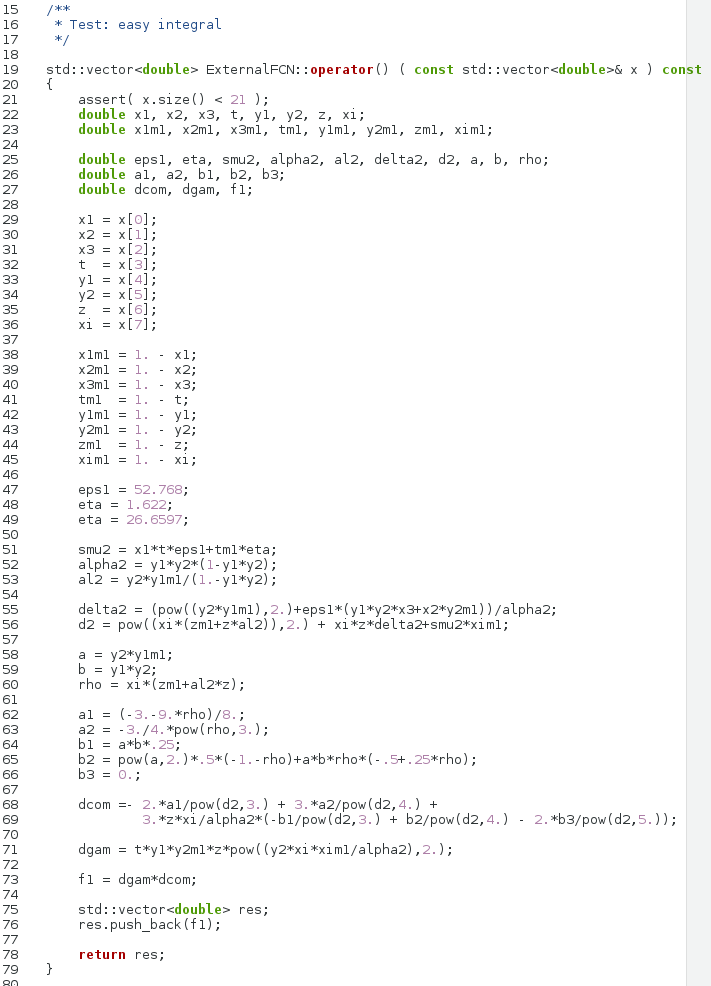
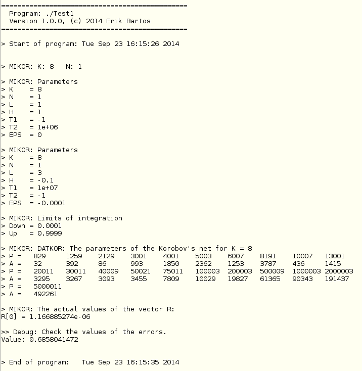

Mikor
=====

C++ package for a numerical evaluation of multidimensional integrals
with constant limits of integration by the Korobov's method [Korobov's method](http://wwwinfo.jinr.ru/programs/jinrlib/d121.htm).
The package is a translation of former Fortran package.

Preview
=======

|  |
|:--:|
|  |

Start
=====

```
autoreconf (or try add options: --force --install)
./configure
make
```

Usage
=====

Next from command line run the executables, e. g.,
```
./src/Mikor
./src/Test1
./src/Test2
```

Bugs and remarks
================

Bugs can be reported via the [Issue Tracker](https://github.com/Mezek/mikor/issues) of Github.
